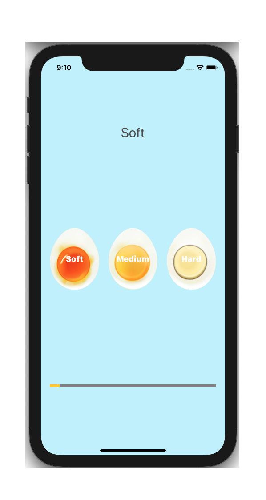

# EggTimer
### Screen Shots

---

### Table of Contents

- [Description](#description)
- [How To Use](#how-to-use)
- [Author Info](#author-info)

## Description

- A simple EggTimer app that alarms the user once the eggs are done boiling.

---

### What I Learned:

- Swift Collection types - Dictionaries
- The Swift Timer API
- Conditional statements - IF/ELSE
- Conditional statements - Switch
- Functions with outputs
- How to use the ProgressView

---

## How To Use

- Clone the project and run it on Xcode
---

## Author Info
- Website - [LinkedIn: Gurpreet Singh](https://www.linkedin.com/in/gurpreet-singh-a2651b107/)

[Back To The Top](#EggTimer)
